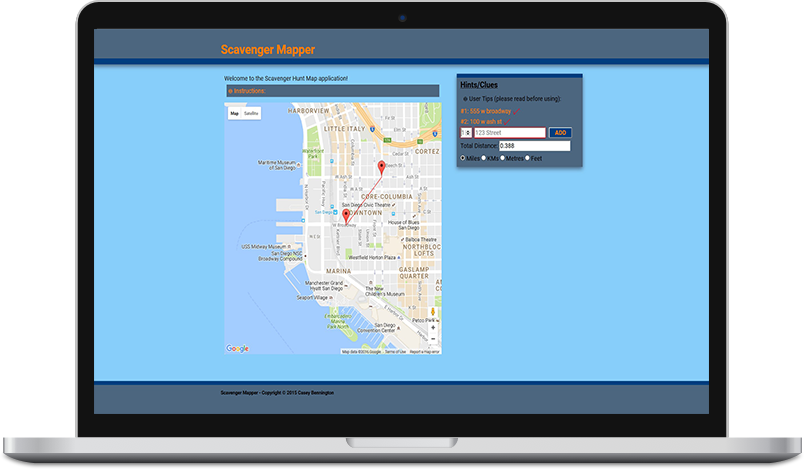

# Scavenger-Mapper
Map application used during scavenger hunts

Welcome to the Scavenger Hunt Map application!

This app will allow you to enter your hint/clue address or coordinate locations in the list and have them placed on the map for easy tracking. In the future you will even be able to track the distance between the locations and calculate the quickest route by distance.

To begin, simply start entering your locations in the Hints list.
DO NOT use the '&' symbol for cross streets. Use 'and' instead. And most importantly, the more precise you are with your address, the more accurate the marker will be. Good Luck!

[See it here.](http://caseybennington.github.io/Scavenger-Mapper/)
